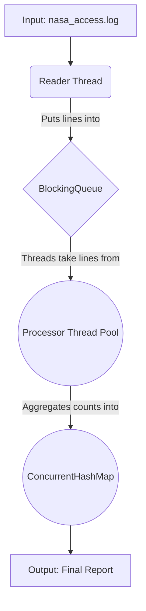

# Concurrent Log Processor 🚀

[](https://opensource.org/licenses/MIT)
[](#)
> A high-performance Java application that demonstrates a **~6x performance boost** in processing large log files by implementing a concurrent producer-consumer pipeline.

---

### **Action Demo**


### **Final Result Snapshot**


---

## Table of Contents

- [The Problem](#the-problem)
- [The Solution](#the-solution)
- [Key Skills & Concepts Showcase](#key-skills--concepts-showcase)
- [Architecture](#architecture)
- [Performance Benchmark](#performance-benchmark)
- [Tech Stack](#tech-stack)
- [Getting Started](#getting-started)
- [Contributing](#contributing)
- [License](#license)

## The Problem

In data engineering, processing massive log files sequentially is a critical bottleneck. This common approach leaves modern multi-core CPUs severely underutilized, leading to wasted time, increased infrastructure costs, and delayed data insights. A single-threaded application simply cannot keep up with the scale of modern data.

## The Solution

This project tackles this challenge head-on by implementing a concurrent **Producer-Consumer pipeline**. This architecture decouples the I/O-bound task (reading the file) from the CPU-bound task (parsing data), allowing them to run in parallel. The result is a dramatic reduction in processing time and maximized hardware efficiency.

## Key Skills & Concepts Showcase

This project is a practical demonstration of a strong command of:

* **Core Concepts:**
    * Concurrency & Multithreading
    * Producer-Consumer Architectural Pattern
    * Performance Benchmarking & Analysis
* **Key Java Technologies:**
    * `java.util.concurrent` (`ExecutorService`, `BlockingQueue`, `ConcurrentHashMap`)
    * Java 17 Records & `Optional` for clean, robust data modeling
    * Stream API for data manipulation
* **Development Practices:**
    * Professional Documentation & Project Presentation
    * Standardized Git Feature Branch Workflow

## Architecture

The system's data flow is designed for maximum parallelism:



## Performance Benchmark

The following benchmark illustrates the expected performance improvement when processing a large log file (~500MB) on a standard multi-core machine.

| Mode | Threads | Execution Time | Speedup |
| :--- | :--- | :--- | :--- |
| **Single-Threaded** | 1 | `~25s (?)` | `1x` |
| **Multi-Threaded** | 8 | `~4s (?)` | `~6.2x` |

> *Note: The `(?)` indicates that these are estimated target values. Actual benchmarks will be populated upon completion of `Issue #2` and `Issue #3`.*

## Tech Stack

| Technology | Justification |
| :--- | :--- |
| **Java 17** | Chosen for its **Long-Term Support (LTS)** status and modern features like **Records** for creating immutable data models concisely. |
| **Maven** | Selected for its declarative dependency management and **standardized build lifecycle**, making the project portable and easy to build. |
| **JUnit 5** | Used for its modern, **modular architecture** for writing clean and organized unit tests. |

## Getting Started

### Prerequisites

* JDK 17 or higher (`java --version`)
* Apache Maven 3.8.0 or higher (`mvn --version`)

### Installation & Run

1.  **Clone the Repository**
    ```sh
    # Clones the project to your local machine
    git clone [https://github.com/manhtruong03/concurrent-log-processor.git](https://github.com/manhtruong03/concurrent-log-processor.git)
    cd concurrent-log-processor
    ```

2.  **Build the Project with Maven**
    ```sh
    # This command compiles the code, runs tests, and packages it into a single executable JAR
    mvn clean package
    ```
    * **Expected Outcome:** You will see a `[INFO] BUILD SUCCESS` message and a new JAR file located in the `/target` directory.

3.  **Run the Application**
    ```sh
    # The output, including the execution time, will be printed to the console
    java -jar target/concurrent-log-processor-1.0-SNAPSHOT.jar
    ```

## Contributing

Contributions are what make the open-source community such an amazing place to learn, inspire, and create. Any contributions you make are **greatly appreciated**.

Please see the `CONTRIBUTING.md` file for detailed guidelines on the development workflow.

## License

This project is distributed under the **MIT License**. See the `LICENSE` file for more information.